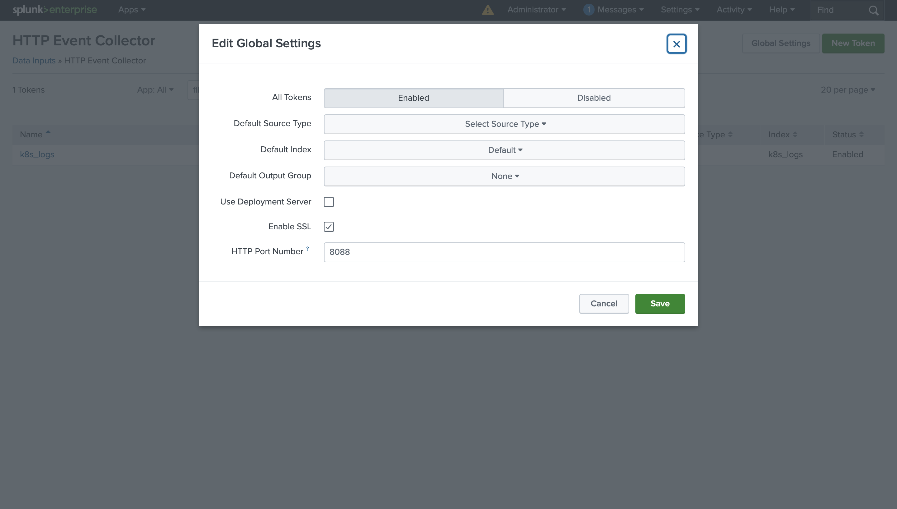

# Observability: Monitoring & Logging
---
## Table of Contents

1. [Overview of Observability](#Overview-of-Observability)
2. [Architecture](#Architecture)
3. [Features](#Features)
4. [User Handbook](#User-Handbook)
5. [Contributing](#contributing)
6. [License](#license)
7. [Acknowledgements](#acknowledgements)
---
## Overview of Observability

### Observability: Monitoring & Logging
Provides real-time insights into the health, performance, and status of workloads running within the Kubernetes environment. As the solution consists of structured logging, monitoring, and alerting, we enable efficient troubleshooting and rapid investigation of potential issues.

## Project Description

### Project Overview
The project aims to provide real-time insights into the health, performance, and status of workloads running within the Kubernetes environment. As the solution consists of structured logging, monitoring, and alerting, we enable efficient troubleshooting and rapid investigation of potential issues.
### Project Purpose
The purpose of this project is to provide real-time insights into the health, performance, and status of workloads running within the Kubernetes environment. As the solution consists of structured logging, monitoring, and alerting, we enable efficient troubleshooting and rapid investigation of potential issues.

## Objectives:

### General Objectives
To use prometheus, alertmanager, grafana, and splunk to monitor logs of webapp and k8s cluster for efficient troubleshooting and problem/incident investigation.

Specifically, the group aims to do the following per tools:

- Webapps
   - Deployed in a Kubernetes cluster
   - Properties that enable to simulate the following issues:
      - High HTTP 5xx errors
      - High HTTP 4xx errors
      - Exporters stopped working
      - Splunkforwarder service or sidecar stopped working
           
- Jenkins
   - Set up a CI/CD pipeline that builds and deploys the app whenever code changes.
       
- Prometheus
   - Metric gathering solution of webapp.
       
- Alerting using Alertmanager/Prometheus or Splunk
    - Create alerting rules based on the KPIs:
        - % availability
        - Resource Utilization
        - Out of Memory Errors
        - Error Rates
   - Establish threshold and implement annotations

- Grafana
   - Use Prometheus as data source
   - Create a set of dashboard to monitor the following:
      - Cluster overview
         - count of pods running
         - count of pods failed
         - count of pods ready
         - ccount of pods not ready
         - node count
         - etc
      - Chart view of containers
         - resource utilization
         - pod resources
         - node resources over time

- Splunk
   - ingest logs from both webapp and k8s cluster
   - create custom dashboard for different components of the webapp
      - user activity
      - error rates
   - configure user roles and permissions, allow new users to search through log with minimum privileges.

---
## Architecture
### Source Code Management(SCM)
<div align="center">
   
</div>

- Source Code Management (SCM): GitHub
- CI/CD Automation Server: Connects to GitHub
- Build Docker Images: CI/CD server pushes images to Dockerhub
- Deployment: Kubernetes cluster pulls images from Dockerhub
- Nodes:
   - Node 1: Contains CI/CD Automation Server and Static Website
   - Node 2: Contains Monitoring and Logging tools
- Monitoring and Logging Tools:
   - Prometheus
   - Grafana
   - Splunk
---
## Features
### Webapp Deployment
- Capable of generating log messages using standard logging patterns and levels.
- A static web application designed to simulate production issues, such as high 5XX and 4XX errors, disruptions in Prometheus exporters, and failures in the Splunk forwarder service or sidecar containers.

### Jenkins (CI/CD Pipeline)
- Automates the build and deployment of the web application whenever changes are made to the source code.

### Splunk
- Capable of ingesting logs from both the web application and the Kubernetes cluster.
- Parses and extracts relevant fields from log entries in a structured manner, facilitating easier log analysis while ensuring sensitive data, such as credentials, is filtered out.
- Dashboard Features:
   - Accurately tracks user activity and error rates.
   - Allows configuration of user roles and permissions, enabling new users to search through logs with restricted privileges.

### Prometheus
- Collects data metrics related to the web application or service, providing insights into performance and resource usage.

### Alerting
- Provides notifications based on key performance indicators (KPIs), such as availability percentage, resource utilization, out-of-memory errors, and error rates.
- Allows the establishment of thresholds and the implementation of annotations for better monitoring.
  
### Grafana
- Provides a dashboard integrated with Prometheus to monitor real-time metrics.
- Accurately counts the number of nodes or pods, categorized by their various statuses.
- Displays charts that visualize container resource utilization, pod resources, and node resources over time.

---
## User Handbook

### 1. Installing Jenkins in a Kubernetes Cluster
- Create a namespace:
```bash
$ kubectl create namespace jenkins
```
- Create a Service Account:
```bash
$ vi jenkins-serviceaccount.yaml
```
- Copy and paste the following:
```bash
apiVersion: rbac.authorization.k8s.io/v1
kind: ClusterRole
metadata:
  name: jenkins-admin
rules:
  - apiGroups: [""]
    resources: ["*"]
    verbs: ["*"]
---
apiVersion: v1
kind: ServiceAccount
metadata:
  name: jenkins-admin
  namespace: jenkins
---
apiVersion: rbac.authorization.k8s.io/v1
kind: ClusterRoleBinding
metadata:
  name: jenkins-admin
roleRef:
  apiGroup: rbac.authorization.k8s.io
  kind: ClusterRole
  name: jenkins-admin
subjects:
  - kind: ServiceAccount
    name: jenkins-admin
    namespace: jenkins
```
- Then apply the Service Account:
```bash
$ kubectl apply -f jenkins-serviceaccount.yaml
```
- Create PVC for Persistent Jenkins Data:
```bash
$ vi jenkins-volumes.yaml
```
- Copy and paste the following:
```bash
apiVersion: v1 
kind: PersistentVolumeClaim 
metadata: 
  name: jenkins-pvc 
  namespace: jenkins 
spec: 
  storageClassName: linode-block-storage-retain 
  accessModes: 
    - ReadWriteOnce 
  resources: 
    requests: 
      storage: 10Gi 
```
- Then apply the PVC:
```bash
$ kubectl apply -f jenkins-volumes.yaml
```
- Create Deployment:
```bash
$ vi jenkins-deployment.yaml
```
- Copy and paste the following:
```bash
apiVersion: apps/v1 
kind: Deployment 
metadata: 
  name: jenkins 
  namespace: jenkins 
spec: 
  replicas: 1 
  selector: 
    matchLabels: 
      app: jenkins-server 
  template: 
    metadata: 
      labels: 
        app: jenkins-server 
    spec: 
      securityContext: 
            fsGroup: 1000 
            runAsUser: 1000 
      serviceAccountName: jenkins-admin 
      containers: 
        - name: jenkins 
          image: jenkins/jenkins:lts 
          resources: 
            limits: 
              memory: "2Gi" 
              cpu: "1000m" 
            requests: 
              memory: "500Mi" 
              cpu: "500m" 
          ports: 
            - name: httpport 
              containerPort: 8080 
            - name: jnlpport 
              containerPort: 50000 
          livenessProbe: 
            httpGet: 
              path: "/login" 
              port: 8080 
            initialDelaySeconds: 90 
            periodSeconds: 10 
            timeoutSeconds: 5 
            failureThreshold: 5 
          readinessProbe: 
            httpGet: 
              path: "/login" 
              port: 8080 
            initialDelaySeconds: 60 
            periodSeconds: 10 
            timeoutSeconds: 5 
            failureThreshold: 3 
          volumeMounts: 
            - name: jenkins-data 
              mountPath: /var/jenkins_home 
      volumes: 
        - name: jenkins-data 
          persistentVolumeClaim: 
              claimName: jenkins-pvc
```
- Then apply the deployment:
```bash
$ kubectl apply -f jenkins-deployment.yaml
```
- Create a service to expose Jenkins:
```bash
$ vi jenkins-service.yaml
```
- Copy and paste the following:
```bash
apiVersion: v1 
kind: Service 
metadata: 
  name: jenkins-service 
  namespace: jenkins 
  annotations: 
      prometheus.io/scrape: 'true' 
      prometheus.io/path:   / 
      prometheus.io/port:   '8080' 
spec: 
  selector: 
    app: jenkins-server 
  type: NodePort 
  ports: 
    - port: 8080 
      targetPort: 8080 
      nodePort: 30000 
```
- Then apply the service:
```bash
$ kubectl apply -f jenkins-service.yaml
```
- To Access the Jenkins UI
   - To view the initial password
```bash
$ kubectl get pods -n jenkins 
$ kubectl logs <pod-name> -n jenkins
```
   - To view the IP Address
```bash
$ kubectl get nodes -o wide
```
   - To access via browser
```bash
<node-IP-Address>:30000
```

---
## Installation

Explain how users can install and set up the project. This may include prerequisites, installation steps, and dependencies.

Example:
### Prerequisites
- Node.js 14+
- npm 7+

### Steps
1. Clone the repository:
    ```bash
    git clone https://github.com/username/project-name.git
    ```
2. Install dependencies:
    ```bash
    cd project-name
    npm install
    ```
3. Start the application:
    ```bash
    npm start
    ```
    
### 2. Set up for Auto-Build per Commit in Jenkins
- Creating Webhook
   - Go to Repository **Settings > Webhooks**
      - <Jenkins URL>/github-webhook/

---

## Usage

Provide examples of how to use your project once it’s installed. This could include code snippets, command-line instructions, or screenshots.

Example:
After starting the app, open your browser and navigate to `http://localhost:3000` to view the interface. Login with your credentials and start exploring your spending patterns!

---

## Contributing

Explain how others can contribute to your project. You might include a guideline on how to submit bug reports, feature requests, or pull requests.

Example:
We welcome contributions! If you have an idea for an improvement or find a bug, please follow these steps:
1. Fork the repository.
2. Create a new branch (`git checkout -b feature-branch`).
3. Commit your changes (`git commit -am 'Add new feature'`).
4. Push to the branch (`git push origin feature-branch`).
5. Create a pull request.

---

## License

State the license under which the project is distributed. If you’re unsure, you can use [MIT](https://opensource.org/licenses/MIT).

Example:
This project is licensed under the MIT License - see the [LICENSE](LICENSE) file for details.

---

## Acknowledgements

Give credit to any resources, contributors, or libraries that you used in your project.

Example:
- [React](https://reactjs.org/) for the frontend framework.
- [Chart.js](https://www.chartjs.org/) for data visualization.
- John Doe for providing helpful bug reports.

---

